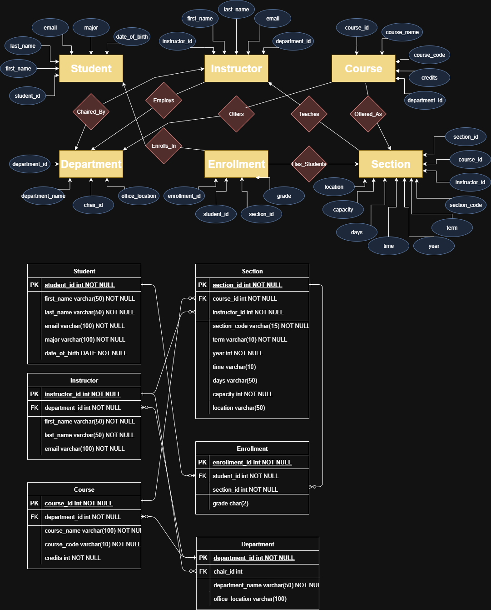

# Academic Database - CSE335-50 - Group 2

## Project Proposal: Academic Student Information Database

The goal of this project is to design and implement a database that stores and manages student and course information for a university or academic institution. The system will include data about students, instructors, courses, and class enrollments. A web-based interface will allow users to query the database to find student details, course rosters, instructor teaching loads, and enrollment statistics. Our group is choosing this database because it is relevant to us as students, and we are already familiar with many similar databases that we have navigated as users. It will allow us to apply our understanding of database design, normalization, and relationships between entities such as students, instructors, and courses.

---

## Project Timeline

| Week | Dates | Task | Notes |
|------|-------|------|-------|
| Week 9 | Oct 12-18 | Planning ✅ | Identify key entities and relationships (students, instructors, courses, enrollment) |
| Week 10 | Oct 19-25 | Database Setup | Implement a normalized schema in SQL (using MySQL) |
| Week 11 | Oct 26-Nov 1 | Data Entry | Fill tables with student, course, and instructor data |
| Week 12 | Nov 2-8 | Backend Development | Build an interface to query the database |
| Week 13 | Nov 9-15 | Frontend Development | Develop a web UI for searching students, viewing rosters, and course details |
| Week 14 | Nov 16-22 | Testing | Make sure everything works as intended, validate the data, and run test queries |
| Week 15 | Nov 23-29 | Final Review | Create the final presentation and documentation |

**Project Due:** Dec 1

---

## Team Members and Responsibilities

| Member | Responsibilities |
|--------|-----------------|
| William Gallagher | Database design, setup, data entry, and final review |
| Luke Aubrey | Frontend, testing, and final review |
| Wyatt Blevins | Backend, and final review |
| Ethan Bailey | Backend, Frontend, final review |

Everyone is working with what they feel most comfortable with, but we will all come together at the end for the final review.

---

# Planning ✅

## 1. Student Table

Stores information about each student.

| Attribute        | Type       | Description |
|-----------------|-----------|-------------|
| `student_id`     | INT (PK)  | Unique identifier for each student. Primary key. |
| `first_name`     | VARCHAR   | Student's first name. |
| `last_name`      | VARCHAR   | Student's last name. |
| `email`          | VARCHAR   | Unique student email address. |
| `major`          | VARCHAR   | The student’s major or field of study. |
| `date_of_birth`  | DATE      | Student's birth date. |

---

## 2. Instructor Table

Stores information about faculty members.

| Attribute        | Type       | Description |
|-----------------|-----------|-------------|
| `instructor_id`  | INT (PK)  | Unique identifier for each instructor. Primary key. |
| `first_name`     | VARCHAR   | Instructor's first name. |
| `last_name`      | VARCHAR   | Instructor's last name. |
| `email`          | VARCHAR   | Unique instructor email address. |
| `department_id`  | INT (FK)  | References the department the instructor belongs to. |

---

## 3. Department Table

Stores information about academic departments.

| Attribute        | Type       | Description |
|-----------------|-----------|-------------|
| `department_id`  | INT (PK)  | Unique identifier for the department. |
| `department_name`| VARCHAR   | Official name of the department. |
| `office_location`| VARCHAR   | Department’s main office location. |
| `chair_id`       | INT (FK)  | References the instructor who is the department chair. Only one chair per department. |

---

## 4. Course Table

Stores information about courses offered by the university.

| Attribute        | Type       | Description |
|-----------------|-----------|-------------|
| `course_id`      | INT (PK)  | Unique identifier for each course. |
| `course_code`    | VARCHAR   | Official course code (e.g., CS101). Unique. |
| `course_name`    | VARCHAR   | Full course name. |
| `credits`        | INT       | Number of credit hours. |
| `department_id`  | INT (FK)  | Department offering the course. |

---

## 5. Section Table

Stores information about a specific offering of a course.

| Attribute        | Type       | Description |
|-----------------|-----------|-------------|
| `section_id`     | INT (PK)  | Unique identifier for the section. |
| `course_id`      | INT (FK)  | References the course being offered. |
| `instructor_id`  | INT (FK)  | References the instructor teaching this section. |
| `section_code`   | VARCHAR   | Unique code for the section (e.g., CS101-01). |
| `term`           | VARCHAR   | Term when the section is offered (e.g., Fall, Spring). |
| `year`           | INT       | Year when the section is offered. |
| `capacity`       | INT       | Maximum number of students allowed. |
| `days`  | VARCHAR   | Days of the week the class meets (e.g., Mon/Wed). |
| `time`  | VARCHAR   | Time of the class (e.g., 10:00-11:30 AM). |
| `location` | VARCHAR | Where the class is held. |

---

## 6. Enrollment Table

Links students to specific sections and stores their grades.

| Attribute        | Type       | Description |
|-----------------|-----------|-------------|
| `enrollment_id`  | INT (PK)  | Unique identifier for the enrollment record. |
| `student_id`     | INT (FK)  | References the student enrolled. |
| `section_id`     | INT (FK)  | References the section the student is enrolled in. |
| `grade`          | CHAR(2)   | Final grade for the student in that section. Can be NULL if the course is in progress. Valid values: `A, A-, B+, B, B-, C+, C, C-, D, F, W, I`. |

---

## 7. Relationship Summary

| Relationship                 | One Side        | Many Side       | Label          |
|-------------------------------|----------------|----------------|----------------|
| Student → Enrollment          | Student        | Enrollment     | Enrolls In     |
| Section → Enrollment          | Section        | Enrollment     | Has Students   |
| Course → Section              | Course         | Section        | Offered As     |
| Instructor → Section          | Instructor     | Section        | Teaches        |
| Department → Instructor       | Department     | Instructor     | Employs        |
| Department → Course           | Department     | Course         | Offers         |
| Department → Chair (Instructor)| Department    | Chair (Instructor) | Chaired By  |

---

## 8. Diagrams

